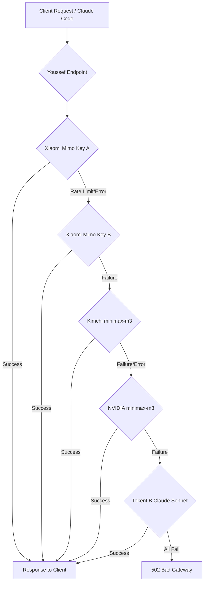

# ⚡ Youssef Endpoint

<p align="center">
  
</p>

<h3 align="center">The Ultimate High-Availability LLM API Gateway</h3>

<p align="center">
  <b>Powered By Youssef Elsayed</b><br/>
  Follow the official page on Facebook: <a href="https://facebook.com/youssefcore.eng">youssefcore.eng</a>
</p>

---

## 🚀 Overview

**Youssef Endpoint** is a production-grade, highly resilient LLM API Gateway designed to provide **100% uptime** and unmatched stability for client agents and tools (such as Claude Code, OpenAI SDK, and customized developer integrations).

It functions as an **Intelligent Failover Proxy** that routes requests through Youssef Elsayed's personal API subscriptions and trial plans. If any provider experiences a rate limit, server crash, or network timeout, the gateway automatically redirects and retries the request with the next best provider in the chain instantly—**completely hidden from the client**.

---

## 🌟 Key Features

*   🔄 **Automatic Failover & Redirection**: Seamless failover across 5 different premium providers. If Provider A fails, Provider B answers, then Provider C, and so on.
*   ⚡ **Zero-Latency Buffering**: Completely rewritten streaming pipeline preventing data loss during transmission (ideal for large codeblocks).
*   🛠️ **Claude Code Compatibility**: Specifically optimized for agentic workflows, complex tool calling, and long reasoning loops without timeout errors.
*   📦 **Dual-Protocol Engine**: Implements both **OpenAI Chat Completions** and **Anthropic Messages** specifications.
*   🔒 **Lightweight & Database-Free**: No databases, authorization overhead, or third-party storage, ensuring maximum execution speed.

---

## 📐 How the Failover Architecture Works

The client makes a single HTTP request to Youssef Endpoint. The gateway acts as a smart dispatcher:



---

## 🔌 API Endpoints

### 1. OpenAI-Compatible Route
*   **Path**: `POST /v1/chat/completions`
*   **Purpose**: Seamless replacement for `api.openai.com`. Pass any standard OpenAI payload.

### 2. Anthropic-Compatible Route
*   **Paths**: `POST /claude/v1/messages` (Aliases: `/claude/messages`, `/claude`)
*   **Purpose**: Drop-in proxy replacement for `api.anthropic.com`. Supports rich tool calling schemas and streaming blocks.

---

## 🛠️ Fallback Provider Order

When a request is received, it starts with the first provider. If it encounters a network or HTTP error, it seamlessly attempts the next provider without exposing the failure to the client:

1.  **Xiaomi Mimo** (`mimo-v2.5` - Failover between 2 API keys)
2.  **Kimchi** (`minimax-m3`)
3.  **NVIDIA** (`minimaxai/minimax-m3`)
4.  **TokenLB Claude** (`claude-sonnet-4-6`)

---

## 📥 Download, Installation & How to Run

### Prerequisite
Make sure you have [Node.js](https://nodejs.org/) installed (v18 or higher is recommended).

### 1. Download & Install
Clone the repository and install the dependencies:
```bash
# Clone the repository
git clone https://github.com/youssef-official/youssef-endpoint.git

# Navigate into the project folder
cd youssef-endpoint

# Install dependencies
npm install
```

### 2. Configuration
Create a `.env` file in the root directory:
```env
PORT=3001

# API Subscriptions & Trial Keys
KIMCHI_API_KEY=your_key
XIAOMI_API_KEY_A=your_key_a
XIAOMI_API_KEY_B=your_key_b
XIAOMI_MODEL=mimo-v2.5
NVIDIA_API_KEY=your_key
BAI_API_KEY=your_key
TOKENLB_API_KEY=your_key
```

### 3. Run the Server
*   **Development mode (auto-restart on changes)**:
    ```bash
    npm run dev
    ```
*   **Production mode**:
    ```bash
    npm start
    ```
The server will boot and display the professional `Youssef Endpoint` banner on port `3001` (by default).

---

## 🩺 Health Check Script

You can quickly verify the status of all configured providers and API keys to see which ones are working and which ones are failing (e.g. out of credits, network timeout).

To run the health check, use the following command:
```bash
npm run check
```
*(Alternatively, you can run `node check.js` directly)*

This will output a detailed report for every provider configured in your `.env` file, showing either `✅ Working` or `❌ Failed` with the exact error details.

---

## 🤖 Connecting to Claude Code

To force **Claude Code** (Anthropic's official CLI tool) to route its requests through **Youssef Endpoint**, you need to point it to your local server by defining the `ANTHROPIC_BASE_URL` environment variable.

Here is how to set it up for your Operating System:

### 1. Temporary Connection (For the current terminal session)

#### 🪟 Windows (PowerShell)
```powershell
$env:ANTHROPIC_BASE_URL="http://localhost:3001/claude"
claude
```

#### 🪟 Windows (Command Prompt - CMD)
```cmd
set ANTHROPIC_BASE_URL=http://localhost:3001/claude
claude
```

#### 🍎 macOS & 🐧 Linux (Bash/Zsh)
```bash
export ANTHROPIC_BASE_URL="http://localhost:3001/claude"
claude
```

---

### 2. Persistent Connection (Works automatically every time you start Claude)

Instead of setting the variable every time, you can configure Claude Code permanently via its configuration file `settings.json`.

#### Step 1: Open/Create the configuration file:
*   **Windows**: `%USERPROFILE%\.claude\settings.json`  *(Equivalent to: `C:\Users\<Your-Username>\.claude\settings.json`)*
*   **macOS & Linux**: `~/.claude/settings.json`

#### Step 2: Edit the file to include the `env` config:
Paste the following JSON structure inside the file:
```json
{
  "env": {
    "ANTHROPIC_BASE_URL": "http://localhost:3001/claude"
  }
}
```

#### Step 3: Launch Claude Code
Just type `claude` in any terminal! It will automatically route all queries, reasoning loops, and code generation files to **Youssef Endpoint** without needing to type environment variables again.

---

## 🎯 About the Developer

Developed and maintained by **Youssef Elsayed**. Built to power intelligent coding assistants and LLM agents with high-performance routing.

*   **Facebook Page**: [youssefcore.eng](https://facebook.com/youssefcore.eng)
*   **GitHub**: [@youssef-official](https://github.com/youssef-official)
